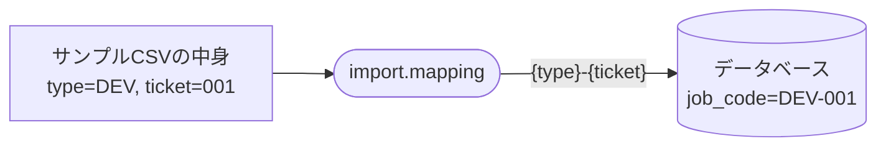
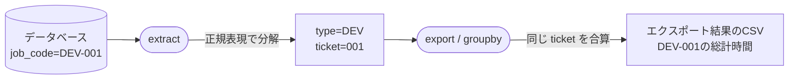

# Configuration Profile (`profile.toml`)

`~/.wtl/profile.toml` は、インポート時と、エクスポート時のデータ構造を定義するファイルです。

## 🔄 データの流れとプロファイルの役割

### 📥 1. インポート時: CSV から `job_code` を作り出す

`wtl job import` でジョブを一括登録する際、CSVのカラム名を組み合わせて、システム内で識別・集計に使うための `job_code` を生成できます。



### 📤 2. エクスポート時: `job_code` を分解して集計する

`wtl log export` で作業履歴を出力する際、データベース内の `job_code` を再び分解し、同じチケット番号などの条件で作業時間を**自動で足し合わせて**CSVに出力します。



---

## 🛠 プロファイル設定のステップ・バイ・ステップ

デフォルトで生成される `profile.toml` は、以下のセクションに分かれています。

- `[import.mapping]`: インポート時、CSVの列を内部データ構造にどう組み込むかを設定します。
- `[export.extract]`: エクスポート時、内部の `job_code` を分解して変数を取り出すルールを設定します。
- `[export.defaults]`: 抽出した変数が空だった場合の初期値（デフォルト値）を設定します。
- `[export]`: 変数をもとに作業記録をどうグループ化・合算し、どうフォーマットするかを設定します。
- `[export.columns]`: 最終的に出力するCSVのカラム（ヘッダーと中身）を設定します。

各セクションを次のように設定します。

### Step 1: インポートの設定

`[import.mapping]` セクションでは、CSVをインポートする際に読み込む列を指定します。

- `name`: データベースの `name` (ジョブ名) として登録する値を引数や固定文字列で指定します。
- `description`: データベースの `description` (ジョブの詳細) として登録する値を指定します。
- `job_code`: データベースの `job_code` (識別・集計用のコード) として登録する値を指定します。

```toml
[import.mapping]
# CSVの "name" 列をそのままジョブ名にする
name = "{name}"
# CSVの "詳細" 列を詳細にする
description = "{詳細}"
# CSVの "type" 列と "ticket" 列をハイフンで繋いで job_code にする
job_code = "{type}-{ticket}"
```

### Step 2: 出力時の変数抽出方法の設定

`[export.extract]`セクションでは、export時に `job_code` をどう解釈し、分解するかを指定します。

- `job_code`: `job_code` の解釈方法を指定します。Pythonの正規表現の名前付きグループ `(?P<変数名>パターン)` で記述します。

`[export.defaults]` セクションでは、`[export.extract]` > `job_code`で指定した正規表現にマッチしなかった場合（または空の場合）の初期値を指定します。

- **左側のキー**: デフォルト値を設定したい変数名を指定します（例: `type`）。
- **右側の値**: 正規表現にマッチしなかった場合に入る初期値を指定します（例: `"General"`）。

```toml
[export.extract]
# "DEV-001" を "type"='DEV' と "ticket"='001' という変数に分解する
job_code = "^(?P<type>[A-Za-z]+)-(?P<ticket>\\d+)$"

[export.defaults]
# 正規表現にマッチしなかった場合（または空の場合）の初期値
type = "General"
ticket = "None"
```

### Step 3: グループ化と集計の設定

`[export]`セクションで、システムがあらかじめ解釈する**固定のキーパラメータ**に対して値を設定します。

- `group_by`: どの変数を基準にして作業データを**グループ合算**するかを指定します。
- `note_item`: 1行にまとめる際、各ログの備考 (`memo`) 等をどのようなフォーマットで表記するかを指定します。
- `note_separator`: 複数の備考をつなぎ合わせる際の区切り文字を指定します。

```toml
[export]
# type と ticket が同じログは、1行にまとめて作業時間を合算する！
group_by = ["type", "ticket"]

[export.format]
# 1行にまとめる際、各ログの備考(memo)をどういうフォーマットで表記するか
note_item = "[{project_name}/{job_name}] {time_hours}h: {memo}"
# 複数の備考を何で区切って繋げるか
note_separator = " / "
```

### Step 4: 最終出力CSVのカラム定義

`[export.columns]`セクションで、出力するCSVの実際の「ヘッダー名」と「中身」を対応づけます。

- **左側のキー（`"種別"` 等）**: 出力されるCSVのカラム名として**自由に決めてよい**名前です。
- **右側の値（`"{type}"` 等）**: 事前定義済みの変数（**決まっている変数名**）を使って、その列に入るデータを指定します。

```toml
[export.columns]
"種別" = "{type}"
"チケット番号" = "{ticket}"
"合計作業時間" = "{aggregated_time}"
"作業詳細 (合算)" = "{aggregated_notes}"
```

---

## 📖 チートシート: 利用可能な変数一覧

プロファイル（`{}` の中）で使える事前定義済みの変数です。

### ログ1件が持つ基本データ（`export.format.note_item` 等で使用）

| 変数名         | 説明                                        | 例                  |
| :------------- | :------------------------------------------ | :------------------ |
| `project_name` | プロジェクト名                              | `"Example Project"` |
| `job_name`     | ジョブ名                                    | `"Fix Database"`    |
| `memo`         | その作業の備考欄                            | `"バグ修正対応"`    |
| `time_hours`   | その作業にかかった時間（時間単位、小数2桁） | `1.25`              |

*(※上記に加え、`[export.extract]`で分解した独自変数(例:`type`, `ticket`)も使えます)*

### グループ集計後のデータ（`export.columns` で使用）

| 変数名             | 説明                                                        |
| :----------------- | :---------------------------------------------------------- |
| `aggregated_time`  | グループ内の全作業時間の合計 (`time_hours` の合計)          |
| `aggregated_notes` | グループ内の `note_item` を `note_separator` で連結した結果 |

---

## 🍳 そのまま使える！設定レシピ集

やりたいことに合わせて、`profile.toml` の中身を丸ごと置き換えてください。

### レシピA: フラット出力（グループ化せず、全記録をそのまま出す）

「合算なんていらない！1回スタート/ストップした記録をそのまま1行のCSVで出したい」という場合の設定です。

```toml
[export.extract]
job_code = ""

[export.defaults]

[export]
# グループ化の基準をなくすか、絶対に被らないものを指定する
# (※未指定/空リストにすると全体が1つに合算されてしまうため、一意な要素を入れるなどシステム仕様に応じた調整が必要です。単純にすべて出す場合はログ自体に固有のIDがないため、時間単位での出力となります)
# 簡単なハックとして memo などを入れます
group_by = ["project_name", "job_name", "memo"]

[export.format]
note_item = "{memo}"
note_separator = " / "

[export.columns]
"Project" = "{project_name}"
"Task" = "{job_name}"
"Time (Hours)" = "{aggregated_time}"
"Memo" = "{aggregated_notes}"
```

*(※フラット出力専用のフラグはないため、事実上は `groupby=["start_time"]` などを内部でサポートする拡張が必要になる場合があります)*
